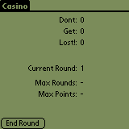
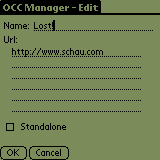
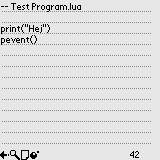

# Portfolio

This is my portfolio repository. It is basically a timeline of the stuff I've created during the years across several platforms

## Commodore 64

### Neagox
This is a small (unfinished) game for the Commodore 64. We were three guys (me, Peter and Jacob) and we submitted the game to Hewson. Got good grades for the graphics, the music and the overall technical implementation. We got shitty grades for the gameplay and the overall design of the levels. You know, the stuff that matters.

It's a shitty game.

#### Downloads

* [The music](c64/neagox.mp3)
* [The game](c64/neagox.zip) - sorry, the source code is gone

## Amiga

I was a part of the 'scene - yuuup, the good 'ol scene. Those were the days ... greetz to [Bastards](http://janeway.exotica.org.uk/author.php?id=1938), [Asperity](http://janeway.exotica.org.uk/author.php?id=29050), [Disorder](http://janeway.exotica.org.uk/author.php?id=25712), [Cyber Visions](http://janeway.exotica.org.uk/author.php?id=59937), [Kefrens](http://janeway.exotica.org.uk/author.php?id=665) and others!

No source code is available. But click on the image to go to the [Janeway](http://janeway.exotica.org.uk/author.php?id=7811) entry.

## Palm OS

The period where I developed for the Palm OS is probably my most active period. I was almost in love with the platform :-)

The programs are written in _c_ and some of the programs have a desktop companion conduit written in _c++_ (-ish).

(Click on the image to go to the source code :-)

Without screenshots:

* [LoginMan](palmos/loginman/)
* [Secure It](palmos/secureit/)

## Pebble

The Pebble Smartwatch was a totally awesome smartwatch and I created a couple of apps for it.
The apps are written in _c_.

All apps and watchfaces are precompiled, [ready to install](pebble/precompiled-pbws/).

### 10-20-30
Follow the 10-20-30 run program.

Go to [10-20-30 source code](pebble/TenTwentyThirty/).

### Big
Watchface with big numbers.

Go to [Big source code](pebble/Big/).

### esignatur Watchface V2
Probably only for me.

Go to [esignatur Watchface V2 source code](pebble/esignaturWatchfaceV2/).

### First 5km
Run program for your first 5km.

Go to [First 5km source code](pebble/First5km/).

### Fuzzy Dk
Watchface - show fuzzytime in danish.

Go to [Fuzzy DK source code](pebble/FuzzyDk/).

### LCD
Watchface - LCD, looks quite good on the Pebble Round.

Go to [LCD source code](pebble/LCD/).

### Lights
Watchface - lights light up every second.

Go to [Lights source code](pebble/Lights/).

### Ray
Watchface - beams and heartrate.

Go to [Ray source code](pebble/Ray/).

### Sleep Time
Watchface - shows when to sleep and when to be awake.

Go to [Sleep Time source code](pebble/SleepTime/).

### Walkr
Monitor steps and calories burnt.

Go to [Walkr source code](pebble/Walkr/).

### Whip
Program to help you exercise run intervals.

Go to [Whip source code](pebble/Whip/).

### ww Timer
Egg timer and stopwatch in one app.

Go to [ww Timer source code](pebble/wwTimer/).

## Mobile platforms

During the years I've been attacted to mobile (phone / platform) development.

### J2ME

Java 2 MicroEdition (J2ME) programs for the old Nokia Series 30, 40 and 60 and Ericsson phones.
J2ME programs are written in Java. The _Build Tools_ folder contains some of the build tools I developed for my own usage.

Yuuuup - been there, done that!

(Click on the image to go to the source code :-)

Without screenshots:

* [Build Tools](j2me/BuildTools/)
* [Eyes](j2me/Eyes/)
* [P4 Remote](j2me/P4Remote/)
* [Tic Tac Toe](j2me/TicTacToe/)
* [YrthWyrm 2](j2me/YrthWyrm2/)

### Android

Android ... Apps written in Java.

(Click on the image to go to the source code :-)

## iOS

As the rest of the world I've also created apps / games for the iPhone (or rather the iOS series of devices).

None of these are live in the App Store anymore.

### Angles
In Angles you must guess the value of 10 angles. The closer your guess is to the actual angle, the higher you score. Angles is primarily for pupils in the lower grades.

Angles currently comes with support for the following languages: English and Danish.

Go to [Angles source code](ios/Angles/).

### iChains
In iChains you have to score points by exploding balls. To explode balls you must set of one or more chain reactions. The longer the chain the more points you score.
The game consists of 12 levels - each level gets progressively harder but all levels can be completed within a reasonably amount of time.
If you feel like it you can submit your personal best and hopefully achieve a position on the online iChains Top 100 List.

Go to [iChains source code](ios/iChains/).

Without screenshots:

* [BMI Calculator](ios/BMICalculator/)
* [Coin Game](ios/CoinGame/)
* [iStar](ios/iStar/)

## KaiOS

### KaiSub
KaiOS is a fun OS for feature phones. It's a bit limited and when I started to use it, it didn't contain a decent podcast player.
I used a Subsonic server as my main media server and it have a fairly decent podcast player.
KaiSub is a simple web system to bind your KaiOS device to the Subsonic Podcast player.

Go to [KaiSub source code](kaios/kaisub/).

## Games
Besides the various games above I do try out ideas typically in the console. Here is a collection of CLI friendly games in c, go, java and python (pgzero).

* [Games](games/) - all sort of small games - c, go-lang, java, python.

## Other

* [Azure Apps](various/azure-apps) - some functions for Azure - c#.
* [certview](various/certview) - a commandline tool to view certicates in the Windows CSP - .NET Core.
* [ctools](various/ctools) - lots of old (broken?!) tools - c.
* [eplogr](various/eplogr) - a simple ngrok endpoint logger - go.
* [Ethereum](various/ethereum/) - small smart contracts for the Ethereum blockchain - solidity.
* [FamilyASN1](various/family-asn1/) - a sample ASN.1 parser using SNACC - c.
* [FootMail](various/foot-mail/) - a very simple pre Web-2.0 mail client optimized for the mobile phones of the age - php.
* [Grab](various/grab/) - record images from web cam - c.
* [gxdavr](various/gxdavr) - Gnome CardDAV / CalDAV redirection service - go.
* [jc](various/jc) - a commandline Postman wannabe - .NET Core.
* [LambdaFunction](various/lambda-functions) - various Lambda-functions - python / go.
* [Luna HSM Sign](various/luna-hsm-sign/) - shows how to sign using a Luna HSM unit - c#.
* [Nant](various/nant/) - development Nant scripts - c#.
* [PS Tools](various/pstools) - Phantom Stacker - .NET Framework.
* [qmta](various/qmta) - a 7-bit MTA / SMTP daemon - c.
* [snmpproxy](various/snmpproxy) - SNMP masquerade daemon - c.
* [tools](various/tools) - various command line utilities - go.
* [Trail Tools](various/trail-tools/) - ehrm ... - java.
* [ubit](various/ubit/) - some microbit samples (in danish) - js.
* [Wordpress](various/wordpress/) - Wordpress plugins and themes - php.
* [zen](various/zen) - command line task manager - go.

